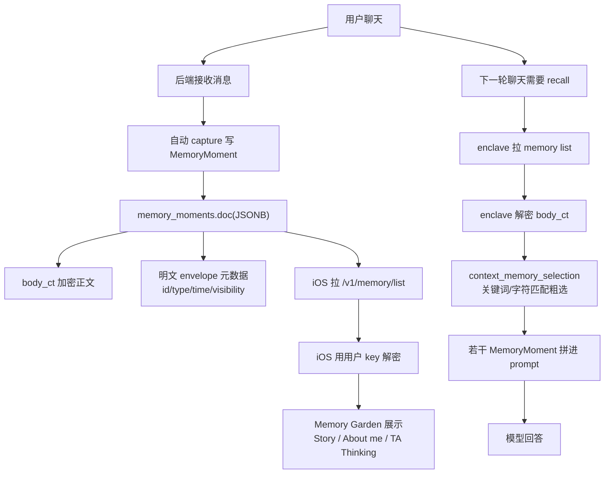
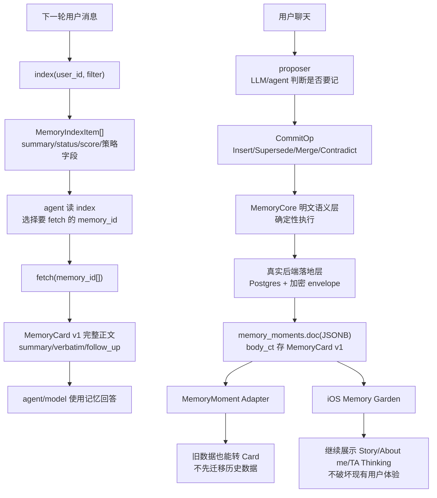

# IO Memory Core v1 联合工程 Spec

> 日期：2026-06-20  
> 作者：Codex 整理，基于 Claude 版主线 + Codex 版线上兼容约束  
> 状态：草案，待 hx/Z、Claude、Seven、zhihao review  
> 范围：先做一个可跑、可测、可对接线上现状的 memory core 工程契约。不含 eval、不含 UI、不含真实加密/DB/网络实现。

---

## 0. 结论

下一步采用 **Claude 版作为主线**：先做一个本地、纯逻辑、可测试的 `MemoryCore`，实现记忆系统最核心的 `commit / index / fetch / decay / bucket resolve` 语义。

同时吸收 **Codex 版护栏**：这个 core 不能脱离线上现状，必须明确兼容当前 `MemoryMoment`、`memory_moments.doc(JSONB)`、加密信封、Memory Garden 展示和 enclave 解密边界。

一句话：

```text
Claude 版负责“做出能跑的记忆核心”。
Codex 版负责“保证这个核心未来接得上现在线上系统”。
```

---

## 1. 产品视角：做完后用户会感受到什么

这不是一个立刻可见的新 UI，而是让 IO 的记忆从“展示型卡片”变成“可持续维护、可被 agent 正确使用的关系记忆系统”。

### 1.1 现在用户体验

现在用户能在 Memory Garden 里看到记忆，例如：

```jsonc
{
  // 当前 Memory Garden 展示用的类型：quote 会进入 Story tab。
  "type": "quote",
  // 展示标题，不一定适合 agent 判断何时使用。
  "title": "不要先给建议",
  // 展示摘要，当前最接近未来 Card.summary。
  "description": "用户不喜欢在难过时被立刻给建议。",
  // 用户原话，当前最接近未来 Card.verbatim。
  "her_quote": "你每次一给步骤我就觉得你不在我身边。"
}
```

这对展示有价值，但系统还不擅长处理这些问题：

1. 用户后来纠正旧印象，旧卡怎么失效。
2. 两张记忆重复或相近，怎么合并。
3. 用户当前说一句隐晦的话，agent 怎么先看摘要再取正文。
4. 敏感记忆什么时候能用、什么时候不能主动提。
5. 记忆随着时间和使用频率如何沉降，而不是越堆越乱。

### 1.2 做完 M1/M2 后的体验

用户不会马上看到一个大改版，但系统内部会能表达：

```jsonc
{
  "old_memory": {
    // 旧理解仍保留，但不再作为默认 active 记忆使用。
    "summary": "用户不喜欢收到建议",
    "status": "superseded",
    "superseded_by": "mem_new"
  },
  "new_memory": {
    // 新理解更准确：不是永远不要建议，而是崩溃时不要先给步骤。
    "summary": "用户只是在情绪崩溃时不希望立刻收到建议；稳定后可以一起处理问题",
    "status": "active",
    "supersedes": ["mem_old"]
  }
}
```

也会支持 agent 先看到轻量目录：

```jsonc
{
  // agent 先看的轻量目录项，不含原话正文。
  "id": "mem_123",
  "summary": "用户崩溃时先需要陪伴和在场感，不要立刻给行动步骤。",
  "bucket_refs": ["安抚方式"],
  "status": "active",
  // 排序分数，来自 importance/recency/surface_count/salience。
  "score": 0.91
}
```

再 fetch 正文：

```jsonc
{
  // agent 选择命中后再 fetch 的完整正文。
  "id": "mem_123",
  "summary": "用户崩溃时先需要陪伴和在场感，不要立刻给行动步骤。",
  "verbatim": "你每次一给步骤我就觉得你不在我身边。",
  "follow_up": "类似场景先表达在场，不要立刻给步骤。"
}
```

对产品来说，最终效果是：

```text
AI 不是“越聊越堆记忆”，而是“记忆会更新、会归类、会沉降、会被正确拿出来”。
```

---

## 2. 当前线上现状

### 2.1 当前存储

当前线上表：

```text
memory_moments
- user_id
- moment_id
- occurred_at
- doc JSONB
```

`doc` 是加密信封。服务端能看到部分外壳字段，正文在 `body_ct`。

```jsonc
{
  // 明文 envelope 字段：服务端可以看到，用于归属、排序、权限和展示路由。
  "id": "mem_123",
  "type": "quote",
  "occurred_at": "2026-06-19T00:00:00Z",
  "created_at": "2026-06-19T00:01:00Z",
  "source": "chat",
  "visibility": "shared",
  "owner_user_id": "user_abc",
  "anchor_memory_ids": [],
  "v": 1,
  // 密文正文：title/description/her_quote/context 等用户语义内容在这里。
  "body_ct": "encrypted-body",
  // 加密 nonce。
  "nonce": "nonce",
  // 给用户设备解密的 key 包裹。
  "K_user": "wrapped-key-for-user",
  // 给 enclave 解密的 key 包裹；local_only 可能没有这个字段。
  "K_enclave": "wrapped-key-for-enclave"
}
```

解密后接近 iOS 的 `MemoryMoment`：

```jsonc
{
  // 与 envelope id 对应。
  "id": "mem_123",
  // 当前线上六类之一：moment/quote/fact/event/insight/reflection。
  "type": "quote",
  // Garden 卡片标题。
  "title": "不要先给建议",
  // Garden 卡片正文摘要。
  "description": "用户不喜欢在难过时被立刻给建议。",
  // 用户原话片段。
  "her_quote": "你每次一给步骤我就觉得你不在我身边。",
  // 场景补充。
  "context": "一次情绪崩溃的聊天",
  // 当前 UI 里的关联维度，未来可映射为 bucket_refs。
  "linked_dimension": "陪伴方式"
}
```

### 2.1.1 当前真实数据结构例子

下面是更贴近当前线上/iOS 解码模型的完整例子。注意：这不是目标结构，而是现在系统已经在跑的 `MemoryMoment` 形态。

```jsonc
{
  // 明文 envelope 元数据：来自 memory_moments.doc，服务端可读。
  "id": "mem_123",
  "type": "quote",
  "occurred_at": "2026-06-19T00:00:00Z",
  "created_at": "2026-06-19T00:01:00Z",
  "source": "chat",
  "visibility": "shared",
  "owner_user_id": "user_abc",
  "anchor_memory_ids": [],

  // 加密 envelope：iOS 或 enclave 解密 body_ct 后才能看到正文。
  "v": 1,
  "body_ct": "base64-ciphertext",
  "nonce": "base64-nonce",
  "K_user": "base64-wrapped-key-for-user",
  "K_enclave": "base64-wrapped-key-for-enclave",

  // body_ct 解密后的展示正文，当前 iOS MemoryMoment 会填充这些字段。
  "title": "不要先给建议",
  "description": "用户不喜欢在难过时被立刻给建议。",
  "her_quote": "你每次一给步骤我就觉得你不在我身边。",
  "context": "一次情绪崩溃的聊天",
  "linked_dimension": "陪伴方式",
  "quoted_in_chat": 0
}
```

前端现在基本把它当成展示卡：

```text
MemoryMoment
  id/type/title/description/her_quote/context/linked_dimension
  -> 根据 type 进入 Story / About me / TA Thinking
  -> 用户点开 MemoryCardDetailView 看详情
```

### 2.2 当前展示

Memory Garden 按 `type` 分 tab：

```text
moment / quote        -> Story
fact / event          -> About me
insight / reflection  -> TA Thinking
```

这个结构本轮必须兼容，不允许因为新 core 破坏现有 Garden 展示。

### 2.3 当前 recall

当前 recall 是 enclave 内部解密后做关键词/字符匹配，不是明确的 `index -> fetch`：

```text
用户消息
  -> enclave 拉 memory list
  -> enclave 解密
  -> context_memory_selection 粗选
  -> 拼进 prompt
```

本 spec 的目标是给未来的 `index -> fetch` 提供核心契约和参考实现。

### 2.4 当前线上流程图



这张图里的关键问题是：当前 recall 是“系统内部挑几张卡塞进 prompt”，还不是 agent 明确执行 `index -> fetch`。

---

## 3. 本期目标与非目标

### 3.0 2026-06-20 M1 定版结论

和 zhihao 对齐后,M1 的真实后端落地口径收窄为 **readside first**。

M1 先做:

1. `MemoryMoment -> MemoryIndexItem` adapter。
2. backend 对外暴露两个接口: `/v1/memory/index`、`/v1/memory/fetch`。
3. backend 用 envelope 明文字段先预筛 top 50。
4. enclave 只解密这 top 50,生成 index / fetch result。
5. `fetch` 返回 `missing_ids / unavailable_ids`,并处理 `local_only`、无 `K_enclave`、跨用户等情况。
6. 保证旧 Memory Garden 不坏、不迁移历史数据、不新增表。

M1 暂不做:

1. `insert`。
2. `supersede`。
3. `merge / contradict / decay`。
4. bucket resolve。
5. route A Consumer 接入。
6. eval 自动化。

人话: 这版先把“读记忆”做扎实。agent 先看目录,选中后再取正文。写入、替代、整理是 M2。

### 3.1 目标

原始完整 MemoryCore 目标保留为 M2/M3 方向。M1 真实后端交付以 §3.0 为准。

M1 本地沙盘已经交付：

1. 一套 `MemoryCore` 类型和接口契约。
2. 一个本地内存实现 `InMemoryMemoryCore`。
3. 一个 `MemoryMoment -> Card` adapter，证明旧线上数据能进入新 core。
4. 单元测试覆盖核心语义。
5. 明确 zhihao 需要对齐的后端/enclave/加密边界。

后端 M1 交付：

1. `/v1/memory/index`。
2. `/v1/memory/fetch`。
3. backend top 50 预筛。
4. enclave 解密候选并生成 index/fetch。
5. 旧 Garden 兼容验证。

### 3.2 非目标

M1 不做：

1. 不做 eval。
2. 不做 UI。
3. 不做真实 DB 写入。
4. 不做新加密机制。
5. 不做 commit / supersede 真实后端接入。
6. 不做 embedding/vector search。
7. 不做 route A 全链路收口。
8. 不迁移历史 memory。

---

## 4. 架构设计

### 4.1 分层

```text
MemoryCore 明文纯逻辑层
  - Card 类型
  - commit/index/fetch/decay/bucket resolve 语义
  - InMemory 实现 + tests

Adapter 线上兼容层
  - MemoryMoment -> Card
  - Card -> MemoryIndexItem

真实后端落地层（zhihao）
  - Postgres JSONB
  - 加密信封
  - enclave 解密
  - HTTP/MCP endpoint
```

本期只实现前两层，第三层只写清楚边界。

### 4.1.1 最终目标流程图



最终形态不是把 Memory Garden 推翻，而是让底层卡片多一层可维护语义：

```text
用户看见：仍然是记忆花园。
agent 看见：index -> fetch 的可用记忆目录。
后端看见：稳定的 commit/index/fetch 语义契约。
```

### 4.2 为什么先做本地 core

本地 core 的价值是把“记忆系统应该怎么运转”从加密、网络、数据库中剥离出来。

这样可以先验证：

1. 新卡怎么写入。
2. 旧卡怎么 supersede。
3. 多张卡怎么 merge。
4. index 返回什么。
5. fetch 返回什么。
6. decay 分数怎么算。
7. 桶名如何 resolve，避免桶爆炸。

这些语义稳定后，zhihao 再把同一套接口包进真实后端。

---

## 5. 数据类型契约

### 5.1 Status

```python
class Status(str, Enum):
    # 默认可被 index 返回、可被 agent 使用的记忆。
    ACTIVE = "active"
    # 被新卡替代；保留审计链，但默认不再召回。
    SUPERSEDED = "superseded"
    # 用户主动归档/删除；默认不进 index。
    ARCHIVED = "archived"
```

不把 `contradicted` 做成 `status`。原因：一张卡可以仍然 active，但和另一张卡冲突，需要用户或 agent 后续澄清。如果把它直接设成 `CONTRADICTED`，容易和 active 状态冲突。

冲突关系单独用 `conflicts_with` 表达。

### 5.2 Salience

```python
class Salience(str, Enum):
    # 低重要度，通常靠 recency 或明确 query 才会浮上来。
    LOW = "low"
    # 默认重要度。
    MEDIUM = "medium"
    # 明显影响关系质量或用户偏好的记忆。
    HIGH = "high"
    # 安全边界、强关系连续性、不能忘的核心记忆。
    CRITICAL = "critical"
```

`salience` 是粗粒度重要性标签，给 index 展示和排序解释用。

排序计算优先用 `importance: float`。

### 5.3 Provenance

```python
@dataclass
class Provenance:
    # 这条记忆来自哪条路径：自建 VPS、model_api、dream/consolidation、旧 MemoryMoment adapter。
    route: str              # "vps" | "api" | "dream" | "legacy_memory_moment"
    # 谁提交了这条记忆：某个 agent、整理 worker，或 adapter。
    committer: str          # agent id / "consolidation" / "adapter"
    # proposer 对这条记忆的置信度；commit 层只记录，不用它做 LLM 判断。
    confidence: float       # 0..1
    # 原始消息或事件发生时间。
    source_ts: float
    # 可选：原始聊天消息 span，用于回链或审计。
    message_span: list[str] = field(default_factory=list)
```

### 5.4 Card

```python
@dataclass
class Card:
    # 全局唯一卡片 id；真实后端仍需保证同 user 下不冲突。
    id: str
    # 跨用户隔离的第一层边界；所有 index/fetch/commit 都必须检查。
    user_id: str

    # Agent/user readable content
    # 给用户和 agent 都能快速理解的一句话。
    summary: str
    # 深读正文/原话片段；index 不返回它，fetch 才返回。
    verbatim: str
    # 记忆桶引用；第一版可以是字符串，真实后端可升级为 bucket_id。
    bucket_refs: list[str]

    # Lifecycle
    # 当前卡生命周期；默认 index 只取 ACTIVE。
    status: Status = Status.ACTIVE
    # 如果这张卡被替代，指向新卡。
    superseded_by: Optional[str] = None
    # 如果这张卡替代了旧卡，记录旧卡 ids。
    supersedes: list[str] = field(default_factory=list)
    # 与哪些卡冲突；冲突不等于失效，所以不塞进 status。
    conflicts_with: list[str] = field(default_factory=list)
    # 需要用户或后续 agent 澄清。
    needs_resolution: bool = False

    # Recall and relationship semantics
    # 未闭合议题，不应随时间过早沉底。
    is_open_thread: bool = False
    # 下次遇到相关场景时 agent 应该怎么用这条记忆。
    follow_up: Optional[str] = None
    # 辅助过滤，不等同 bucket。
    topic_tags: list[str] = field(default_factory=list)
    # 敏感类型，如成人边界/身份/创伤。
    sensitive_scope: Optional[str] = None
    # 是否允许主动浮现。
    surface_policy: str = "safe_to_use_when_relevant"

    # Ranking / decay
    # 粗粒度重要性标签，便于解释和 UI 展示。
    salience: Salience = Salience.MEDIUM
    # 0..1 连续权重，score/decay 主驱动。
    importance: float = 0.5
    # 最近一次被写入/使用/确认的时间。
    last_active: float = 0.0
    # 最近一次被主动展示或被 agent 使用的时间。
    last_surfaced: Optional[float] = None
    # 被使用次数；用于 activation_bonus。
    surface_count: int = 0
    # 用户钉住，不衰减。
    pinned: bool = False
    # 系统或用户指定豁免衰减。
    decay_exempt: bool = False

    # Compatibility and audit
    # 兼容旧 MemoryMoment.type，保留当前 Garden tab 路由。
    source_type: str = "unknown"
    # 来源审计信息。
    provenance: Optional[Provenance] = None
    # 创建/更新时间，真实后端使用服务端时间。
    created_at: float = 0.0
    updated_at: float = 0.0
    # Card schema 版本，便于后续迁移。
    version: int = 1
```

### 5.5 字段原则

每个字段都必须被至少一个操作使用：

| 字段 | 被谁使用 |
|---|---|
| `summary` | index / agent pick / Garden 摘要 |
| `verbatim` | fetch / 深读 / 用户详情 |
| `bucket_refs` | index filter / bucket resolve |
| `status` | index 默认过滤 |
| `superseded_by` / `supersedes` | commit supersede / merge |
| `conflicts_with` / `needs_resolution` | contradict / 后续澄清 |
| `is_open_thread` | index filter / decay 豁免 |
| `follow_up` | agent 使用记忆 |
| `sensitive_scope` / `surface_policy` | 使用/浮现策略 |
| `importance` / `last_active` / `surface_count` | score / decay |
| `source_type` | 兼容 Memory Garden tab |
| `provenance` | 审计 / adapter 追踪 |

---

## 6. MemoryCore 接口

### 6.1 IndexEntry

```python
@dataclass
class IndexEntry:
    # Card id；agent 后续 fetch 使用。
    id: str
    # 让 agent 先按主题判断相关性。
    bucket_refs: list[str]
    # index 只返回 summary，不返回 verbatim。
    summary: str
    # 默认只返回 ACTIVE。
    status: Status
    # 解释重要度。
    salience: Salience
    # 未闭合议题通常排序更高或不衰减。
    is_open_thread: bool
    # 让 agent 知道这是敏感卡，使用时保守。
    sensitive_scope: Optional[str]
    # 让 agent 知道能不能主动提。
    surface_policy: str
    # 排序分数，由 decay/importance/surface_count 算出。
    score: float
```

不包含 `verbatim`。index 是目录，不是正文。

### 6.2 IndexFilter

```python
@dataclass
class IndexFilter:
    # 只看指定桶；None 表示不过滤。
    buckets: Optional[list[str]] = None
    # 只看指定 topic tags；None 表示不过滤。
    tags: Optional[list[str]] = None
    # 粗关键词过滤，只看 summary，不做语义判断。
    keyword: Optional[str] = None
    # 默认只看 ACTIVE。
    status_in: list[Status] = field(default_factory=lambda: [Status.ACTIVE])
    # 只看未闭合议题。
    open_thread_only: bool = False
    # false 时过滤 sensitive_scope 非空的卡。
    include_sensitive: bool = True
    # 返回上限，避免 index 过大。
    limit: int = 50
```

### 6.3 MemoryCore Protocol

```python
class MemoryCore(Protocol):
    # 唯一写入口；所有写入/替换/合并/冲突都走 CommitOp。
    def commit(self, op: "CommitOp") -> "CommitResult": ...
    # 读目录：返回轻量 IndexEntry，不含 verbatim。
    def index(self, user_id: str, f: IndexFilter) -> list[IndexEntry]: ...
    # 深读：按 ids 返回完整 Card。
    def fetch(self, user_id: str, ids: list[str]) -> list[Card]: ...
    # 只读计算，不改变卡状态。
    def decay_scores(self, user_id: str, now: float) -> dict[str, float]: ...
    # 写入前规范化桶名，避免同义桶爆炸。
    def resolve_buckets(self, user_id: str, proposed: list[str]) -> list["BucketMatch"]: ...
```

### 6.4 CommitOp

```python
CommitOp =
  # 新增一张 active 卡。
  | Insert(card: Card)
  # 用 new_card 替代 target，但保留 target。
  | Supersede(target_id: str, new_card: Card)
  # 多张旧卡合并成一张新卡。
  | Merge(target_ids: list[str], merged_card: Card)
  # 两张卡冲突但暂不裁决，标记待澄清。
  | Contradict(a_id: str, b_id: str)
  # 用户主动归档/删除。
  | Archive(target_id: str)
```

`Archive` 只代表用户主动删除/归档，不代表系统衰减自动删除。

---

## 7. 行为规约

### 7.1 Insert

写入一张 `ACTIVE` 卡。

规则：

1. `card.status` 强制设为 `ACTIVE`。
2. `importance` 必须 clamp 到 `0..1`。
3. `updated_at` 不早于 `created_at`。
4. 同 `user_id` 下 `id` 不可重复。

### 7.2 Supersede

用于“旧理解被新理解替代”。

规则：

1. target 必须存在且属于同一 user。
2. target.status 设为 `SUPERSEDED`。
3. target.superseded_by = new_card.id。
4. new_card.status = `ACTIVE`。
5. new_card.supersedes 包含 target_id。
6. 旧卡不删除。

### 7.3 Merge

用于多张旧卡合并成一张更好的卡。

规则：

1. targets 必须都存在且属于同一 user。
2. 所有 targets.status 设为 `SUPERSEDED`。
3. 所有 targets.superseded_by = merged_card.id。
4. merged_card.status = `ACTIVE`。
5. merged_card.supersedes = target_ids。
6. merged_card.bucket_refs = 原 targets 与 merged_card 的并集。

### 7.4 Contradict

用于发现两张 active 记忆互相冲突，但暂时不确定谁对。

规则：

1. a/b 必须都存在且属于同一 user。
2. a.status 和 b.status 保持 `ACTIVE`。
3. a.conflicts_with 添加 b_id。
4. b.conflicts_with 添加 a_id。
5. a.needs_resolution = true。
6. b.needs_resolution = true。

不用 `status=CONTRADICTED`，避免“既 active 又 contradicted”的语义冲突。

### 7.5 Archive

用于用户主动隐藏/删除。

规则：

1. target 必须存在且属于同一 user。
2. target.status 设为 `ARCHIVED`。
3. 默认不出现在 index。
4. fetch 默认仍可按 id 取回，除非真实后端后续实现硬删除。

---

## 8. index / fetch 语义

### 8.1 index 是粗筛，不是智能判断

index 只负责返回 agent 可读目录，不负责最终相关性判断。真实后端 M1 的入口是 `/v1/memory/index`。

```text
backend envelope 明文字段预筛 top 50
  -> enclave 解密候选并生成 index
  -> agent 读 summary 判断
  -> fetch 正文
```

### 8.2 index 过滤

默认：

```python
status_in=[Status.ACTIVE]
limit=50
```

规则：

1. 默认排除 `SUPERSEDED` 和 `ARCHIVED`。
2. `buckets` / `tags` 命中其一即可入选。
3. `keyword` 只对 `summary` 做包含/粗分词匹配。
4. `open_thread_only=true` 只返回 open thread。
5. `include_sensitive=false` 时过滤掉有 `sensitive_scope` 的卡。
6. 按 `score` 降序，截断到 `limit`。

### 8.3 fetch

fetch 根据 ids 返回完整 Card。真实后端 M1 的入口是 `/v1/memory/fetch`。

规则：

1. 只返回属于该 user 的卡。
2. 不存在的 id 放进 `missing_ids`。
3. 保持输入 ids 的顺序。
4. 解不开 / 无 `K_enclave` / `local_only` 放进 `unavailable_ids`。
5. 跨用户 memory 一律按 missing 处理,避免泄露存在性。
6. 本地 core 不做权限/加密；真实后端由 backend/enclave 负责。

---

## 9. decay / score

### 9.1 score 公式

第一版使用简单可解释公式：

```text
score = importance × recency × activation_bonus × salience_multiplier
```

其中：

```text
recency = exp(-lambda_days * days_since_last_active)
activation_bonus = 1 + log(1 + surface_count)
```

`salience_multiplier` 默认：

```python
{
    LOW: 0.75,
    MEDIUM: 1.0,
    HIGH: 1.25,
    CRITICAL: 1.5,
}
```

### 9.2 豁免规则

以下卡不做时间衰减：

1. `pinned=true`
2. `decay_exempt=true`
3. `is_open_thread=true and status=ACTIVE`

豁免卡仍可按 `importance / salience / surface_count` 排序，但不因为时间久自动沉底。

### 9.3 不自动删除

decay 只改变排序分数，不负责删除、不负责 archive。

---

## 10. bucket resolve

目标：避免桶名越写越散。

例子：

```text
["工作烦恼", "工作压力", "工作上的压力"] -> 复用一个桶
```

第一版使用本地纯函数，不引入 embedding：

1. lower/trim/normalize。
2. 字符 n-gram 或 token overlap。
3. 超过阈值返回已有桶名。
4. 否则允许新桶。

返回：

```python
@dataclass
class BucketMatch:
    proposed: str
    resolved: str
    score: float
    is_new: bool
```

真实后端的并发 `resolve-before-create` 需要 zhihao 决定是否使用 per-user advisory lock。

---

## 11. MemoryMoment Adapter

### 11.1 目的

这是 Codex 版必须加入 Claude 主线的部分。

线上已经有 `MemoryMoment`，不能等未来迁移才让新 core 工作。因此 M1 必须提供 adapter：

```text
MemoryMoment -> Card
Card -> IndexEntry
```

### 11.2 映射规则

输入：

```json
{
  "id": "mem_123",
  "type": "quote",
  "title": "不要先给建议",
  "description": "用户不喜欢在难过时被立刻给建议。",
  "her_quote": "你每次一给步骤我就觉得你不在我身边。",
  "context": "一次情绪崩溃的聊天",
  "linked_dimension": "陪伴方式",
  "occurred_at": "2026-06-19T00:00:00Z",
  "created_at": "2026-06-19T00:01:00Z"
}
```

输出：

```json
{
  "id": "mem_123",
  "summary": "用户不喜欢在难过时被立刻给建议。",
  "verbatim": "你每次一给步骤我就觉得你不在我身边。",
  "bucket_refs": ["陪伴方式"],
  "status": "active",
  "source_type": "quote",
  "importance": 0.5,
  "provenance": {
    "route": "legacy_memory_moment",
    "committer": "adapter",
    "confidence": 1.0
  }
}
```

### 11.3 默认值

| Card 字段 | MemoryMoment 来源 | 默认值 |
|---|---|---|
| `summary` | `description` 优先，空则 `title` | `""` |
| `verbatim` | `her_quote` | `""` |
| `bucket_refs` | `linked_dimension` / `context` | `["uncategorized"]` |
| `source_type` | `type` | `"unknown"` |
| `importance` | 无 | `0.5` |
| `salience` | 无 | `MEDIUM` |
| `status` | 无 | `ACTIVE` |
| `is_open_thread` | 无 | `false` |
| `sensitive_scope` | 无 | `None` |
| `surface_policy` | 无 | `"safe_to_use_when_relevant"` |

---

## 12. 明文 / 加密边界

### 12.1 本地 core

本地 `MemoryCore` 全部使用明文 `Card`。

它不包含：

1. 加密。
2. enclave。
3. Postgres。
4. 网络 endpoint。

### 12.2 真实后端

真实落地时，外层负责把明文 core 包起来：

```text
commit:
  agent/proposer 产 Card 或 CommitOp
  -> enclave/后端执行确定性 commit
  -> 语义正文加密进 body_ct
  -> 元数据进 doc JSONB

index:
  backend 取 encrypted list
  -> enclave 解密 summary
  -> core/adapter 生成 IndexEntry
  -> 返回给 runtime/agent

fetch:
  agent 选 ids
  -> enclave 解密完整 Card
  -> 返回正文
```

### 12.3 建议明文字段

```json
{
  "id": "mem_123",
  "type": "quote",
  "status": "active",
  "visibility": "shared",
  "owner_user_id": "user_abc",
  "occurred_at": "2026-06-19T00:00:00Z",
  "created_at": "2026-06-19T00:01:00Z",
  "updated_at": "2026-06-19T00:02:00Z",
  "source": "chat",
  "anchor_memory_ids": []
}
```

### 12.4 建议密文字段

```json
{
  "summary": "用户崩溃时优先需要陪伴和确认在场，不喜欢立刻收到行动步骤。",
  "verbatim": "用户说过：崩溃时不要先给步骤，否则会觉得 AI 不在身边。",
  "bucket_refs": ["安抚方式"],
  "follow_up": "类似场景先陪伴，不要立刻给步骤。",
  "sensitive_scope": null,
  "surface_policy": "safe_to_use_when_relevant",
  "provenance": {
    "route": "api",
    "committer": "agent",
    "confidence": 0.86
  }
}
```

### 12.5 需要 zhihao 拍板

`status / importance / last_active / surface_count / bucket_refs / sensitive_scope / surface_policy` 是否明文，是后端必须拍的点。

建议默认：

1. `status / importance / last_active / surface_count` 可明文，因为排序和状态机需要。
2. `summary / verbatim / follow_up` 必须密文。
3. `bucket_refs` 倾向密文；如果后端需要按桶计数/过滤，可用不透明 `bucket_id` 明文。
4. `sensitive_scope / surface_policy` 倾向密文；如后端必须过滤，只明文放粗粒度 `sensitivity_class`。

---

## 13. 模块结构

建议放在后端 Python 目录下，具体位置由实际 repo 结构决定。逻辑模块建议：

```text
memory_core/
├── types.py
├── core.py
├── decay.py
├── buckets.py
├── adapters.py
└── tests/
    ├── test_commit.py
    ├── test_index_fetch.py
    ├── test_decay.py
    ├── test_buckets.py
    └── test_memory_moment_adapter.py
```

职责：

| 文件 | 职责 |
|---|---|
| `types.py` | Card / Status / Salience / Provenance / IndexEntry / IndexFilter / CommitOp |
| `core.py` | MemoryCore Protocol + InMemoryMemoryCore |
| `decay.py` | score/decay 纯函数 |
| `buckets.py` | bucket normalize/resolve |
| `adapters.py` | MemoryMoment -> Card |

---

## 14. 测试验收

### 14.1 commit tests

必须覆盖：

1. insert 后卡为 ACTIVE。
2. supersede 后旧卡 SUPERSEDED，新卡 ACTIVE。
3. merge 后 targets SUPERSEDED，merged ACTIVE，bucket_refs 并集。
4. contradict 后两卡仍 ACTIVE，但互相 conflicts_with，needs_resolution=true。
5. archive 后默认不进 index。
6. 任何 op 后旧卡不硬删。

### 14.2 index/fetch tests

必须覆盖：

1. index 默认只返回 ACTIVE。
2. index 排除 SUPERSEDED/ARCHIVED。
3. keyword 粗筛命中 summary。
4. open_thread_only 生效。
5. include_sensitive=false 过滤 sensitive_scope。
6. score 降序 + limit 生效。
7. fetch 保持 ids 顺序。
8. fetch 不返回其他 user 的卡。

### 14.3 decay tests

必须覆盖：

1. 普通卡随 last_active 时间衰减。
2. pinned 不衰减。
3. decay_exempt 不衰减。
4. active open_thread 不衰减。
5. surface_count 增加 activation bonus。
6. decay 不会 archive 或删除卡。

### 14.4 bucket tests

必须覆盖：

1. 近义桶复用。
2. 不相似桶新建。
3. normalize 后大小写/空格不影响。
4. 不跨 user 复用。

### 14.5 adapter tests

必须覆盖：

1. `description -> summary`。
2. `her_quote -> verbatim`。
3. `linked_dimension -> bucket_refs`。
4. 空字段 fallback。
5. `type -> source_type`。
6. adapter 生成的 card 可进入 index/fetch。

---

## 15. 里程碑

### M1：MemoryCore Contract + InMemory 实现

产出：

1. 类型定义。
2. InMemoryMemoryCore。
3. MemoryMoment adapter。
4. 单元测试。

成功标准：

1. 本地测试通过。
2. 能把一个旧 MemoryMoment 转成 Card。
3. 能从 Card 生成 IndexEntry。
4. 能通过 fetch 拿回完整 Card。

### M2：本地 recall demo

产出：

1. 给定一组 cards。
2. index 返回目录。
3. stub agent 选择 ids。
4. fetch 返回正文。

成功标准：

1. 不依赖真实 LLM。
2. 不依赖真实 DB/enclave。
3. 能演示 `index -> pick -> fetch`。

### M3：后端/enclave 对接设计

产出：

1. zhihao 确认字段明文/密文边界。
2. zhihao 确认 index/fetch 在哪里执行。
3. zhihao 确认是否先 adapter，后迁移。

### M1-backend：readside 接口落地

产出：

1. backend 暴露 `/v1/memory/index`。
2. backend 暴露 `/v1/memory/fetch`。
3. backend 用 envelope 明文字段预筛 top 50。
4. enclave 解密 top 50 并生成 index/fetch。
5. fetch 返回 `missing_ids / unavailable_ids`。

成功标准：

1. 旧 memory 不迁移也能生成 index。
2. index 不包含 `verbatim / her_quote`。
3. fetch 能拿到正文。
4. `local_only` / 无 `K_enclave` 不可 fetch。
5. 旧 Memory Garden 不受影响。
6. backend 日志不出现 `summary / verbatim / follow_up`。

---

## 16. 需要和 zhihao 沟通的问题

### 必须拍板

1. **MemoryCard v1 是否继续放在 `memory_moments.doc.body_ct`？**  
   建议：是。先不改表。

2. **MemoryMoment 是否先 adapter，不做历史迁移？**  
   建议：是。先兼容，后迁移。

3. **index() 是否在 enclave 内生成？**  
   已定：backend 对外暴露 `/v1/memory/index`,backend 先预筛 top 50,enclave 解密候选并生成 index。summary 语义内容不落 backend 明文。

4. **fetch(memory_id) 是否必须走 enclave？**  
   已定：backend 对外暴露 `/v1/memory/fetch`,正文解密必须走 enclave。fetch 返回 verbatim 和 follow_up，必须解密。

5. **哪些字段明文？**  
   建议：`status / importance / last_active / surface_count` 可明文；`summary / verbatim / follow_up` 密文；bucket 用不透明 id 方案再讨论。

6. **commit 状态机本轮是否进入真实后端？**  
   已定：M1 真实后端只做 readside,不接 insert/supersede/commit。commit 进入 M2。

7. **多 worker 写入如何串行？**  
   建议：真实后端使用 per-user advisory lock 或单写 worker；本地 core 不处理并发。

8. **local_only 如何影响 index/fetch？**  
   建议：local_only 不进 agent index/fetch，只给用户 Garden 看。

9. **sensitive_scope / surface_policy 是否需要明文过滤？**  
   建议：默认密文；如果后端必须做粗过滤，增加明文 `sensitivity_class`。

10. **route A 本轮是否暂不收口？**  
    建议：暂不收口。先跑 model_api/enclave 当前路径。

### 可以后置

1. embedding/vector。
2. eval。
3. 真实 endpoint 命名。
4. 历史数据迁移。
5. replace_scrub 硬抹除。
6. UI 展示改版。

---

## 17. 与 Claude 版 / Codex 版的取舍

### 17.1 采用 Claude 版

采用：

1. 本地纯逻辑 `MemoryCore`。
2. `commit / index / fetch / decay / resolve_buckets` 语义。
3. 单元测试作为第一产出。
4. core 不含加密/DB/网络。

### 17.2 修正 Claude 版

修正：

1. `Contradict` 不再用 `status=CONTRADICTED`，改为 `conflicts_with + needs_resolution`。
2. M1 必须加入 `MemoryMoment -> Card` adapter。
3. 明确当前线上 `doc(JSONB)` 和加密信封边界。
4. 第一阶段不要求真实后端 commit。

### 17.3 采用 Codex 版

采用：

1. 线上兼容优先。
2. 不改表、不迁移历史 memory。
3. `index -> fetch` 是 agent 使用记忆的目标形态。
4. 明确明文/密文边界和 zhihao 对齐问题。

### 17.4 放弃 Codex 版

放弃：

1. 只写契约、不做可跑实现的路径。
2. 过度推迟 commit/decay 语义。

联合版最终取向：

```text
先做 Claude 式可跑 core，但必须带 Codex 式线上 adapter 和后端边界。
```

---

## 18. 风险

### 18.1 本地 core 和真实后端脱节

缓解：M1 就加入 MemoryMoment adapter，并让 zhihao review 明文/密文边界。

### 18.2 第一阶段 scope 过大

缓解：M1 只做 InMemory + tests，不接 DB/enclave/API。

### 18.3 字段过多

缓解：每个字段必须绑定一个操作；无操作使用的字段删除。

### 18.4 sensitive policy 设计过早

缓解：先保留粗字段，不做复杂 policy engine。真实过滤规则后续和安全/产品一起定。

---

## 19. 下一步

1. hx/Z review 本 spec。
2. Claude review 本 spec，重点看是否保留它的工程主线。
3. zhihao review §12 和 §16。
4. 确认后写 implementation plan。
5. M1 实现 `MemoryCore + adapter + tests`。
