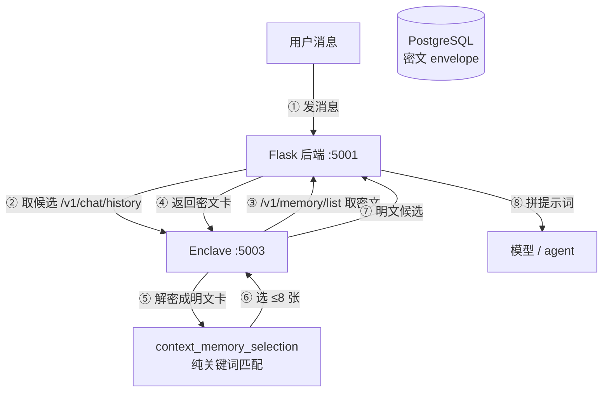
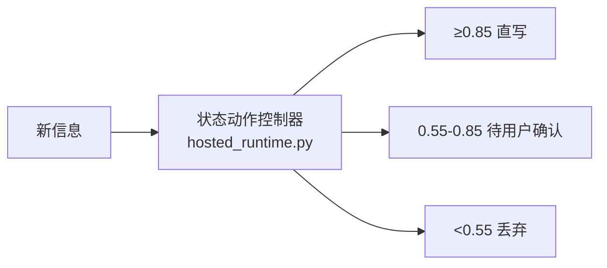
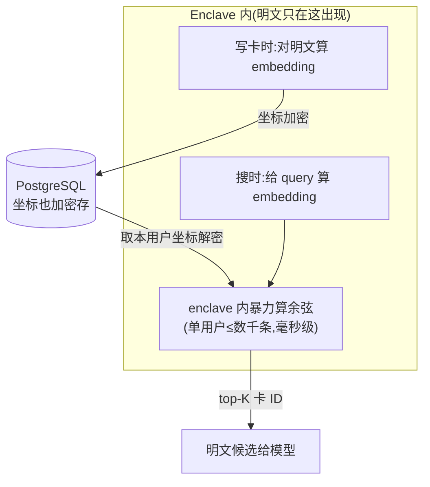

# IO 记忆系统 · 现状全景 + 迭代方向 + 可行性(代码验证版)

> 2026-06-16 
> **本文每条结论都基于真实代码,带 `文件:行` 证据**;明确标注【代码确认】/【需团队决策】/【工作量估】。
> 代码读自 `/Users/hx/Projects/feedling-mcp`(已拉最新)。
>
> **急着看,只读这三节:** §0(结论一句话)· §3(加密挡不挡 RAG)· §7(给 leader 的决策清单)。

---

## 0. 一句话先行

> **加密不挡 RAG**(检索本来就在 enclave 内对解密后的明文做)。**真正缺的是:没有 eval(盲改)、没有跨卡整理、检索零向量。** 三件都【代码确认可行】,而且其中两件有现成骨架可扩展。唯一需要 leader 拍的,是"embedding 在哪算"这一个架构决策。

---

## 1. 全景:记忆系统现在到底怎么跑

> 比喻:IO 给 AI 记了一本"关于你"的笔记本。围着它转的就五个动作:**写 · 存 · 翻 · 整理 · 考试**。

### 1.1 五个动作 · 现状评级(带代码证据)

| 动作 | 现状 | 代码证据 |
|---|---|---|
| **写**(capture) | ✅ 有,自动,6 类 | `app.py:9444` `_model_api_run_memory_capture`;prompt `prompts.py:75-105` |
| **存**(storage) | ✅ 明文元数据 + 密文体 | `alembic/0001_baseline.py:57-64`;`app.py:14138-14156` |
| **写入对账** | ✅ 有(同一轮该不该写) | 阈值 `app.py:8587-8589`(0.85/0.55);`hosted_runtime.py:240-262` |
| **翻**(检索) | ⚠️ 纯关键词,**零向量** | `context_memory_selection.py`(全文,无 embedding) |
| **整理**(跨卡对账) | ❌ 无(只有简单去重) | 仅 `_dedupe_memory_cards` `app.py:7251`;搜 supersede/contradict = 0 |
| **考试**(eval) | ❌ 无(仅 proactive 有) | 只有 `tools/proactive_gate_eval.py`,无记忆质量 eval |

### 1.2 一条记忆卡在库里怎么存的【代码确认】

表 `memory_moments`(`alembic/0001_baseline.py:57-64`):`user_id, moment_id, occurred_at, doc(JSONB)`。**所有内容都塞在 `doc` 这个 JSONB 里**。

```
doc 里:
  明文(DB 可读):v / id / type / occurred_at / created_at / source
                visibility / owner_user_id / enclave_pk_fpr / anchor_memory_ids
  密文(DB 看不懂):body_ct / nonce / K_user / K_enclave
```

> 👉 **重要推论**:加 `lifecycle / weight / 向量` 这些字段,**直接塞进 JSONB 即可,不用改表、不用迁移**(`app.py:13442` 现在就这么干)。

### 1.3 检索链路(关键:解密和选择都在 enclave 内)【代码确认】



- 解密:`enclave_app.py:733-770` `_load_decrypted_moments()` → 每张卡 `_decrypt_envelope` → **明文 dict**(`enclave_app.py:754-755`)。
- 选择:`enclave_app.py:916-922` 调 `select_context_memories()`。
- **选择逻辑零向量**:`context_memory_selection.py` 全程是字符二元组 Jaccard + 关键词/实体启发式打分(`:191-272`),没有任何 embedding/cosine。

> 👉 **这就是为什么"加密不挡 RAG"**:第⑤步 enclave 手里已经是**明文卡**,完全可以拿去算向量。检索这一环本来就在 enclave 内,加向量只是"同一个地方多算一步"。

### 1.4 写入对账(写入侧,已有)【代码确认】


阈值 `app.py:8587-8589`;判定 `hosted_runtime.py:240-262`;过滤 `app.py:8823-8842`。
**注意:这只管"这条新的该不该写",不管"已存的老卡之间该不该合并/作废"——那是缺的(见 §2)。**

---

## 2. 三个真问题(全部代码确认)

1. **盲改**:没有记忆质量 eval(只有 proactive gate 的 `proactive_gate_eval.py`)。改 capture/检索 prompt 无法证明好坏。
2. **只增不整理**:跨卡对账=0(搜 supersede/contradict/merge 无结果);只有 import/recap 时的标题去重 `_dedupe_memory_cards`(`app.py:7251`)。**但有一个 recap worker 骨架**(`app.py:9987-10070`,每 80 轮总结一次)可扩展。
3. **检索太严**:`context_memory_selection.py` 纯关键词,"project"翻不出"东方Project"。
4. **(附)route A 不可控**:Consumer(`chat_resident_consumer.py:3236-3416`)**不读记忆、不注入记忆**,只转发聊天 + 代转发 agent 的 `memory.*` action(`:2179`)。所以我们的检索/整理在 route A 不生效。

---

## 3. 正面回答:加密到底挡不挡 RAG?【代码确认:不挡】

**结论:不挡。** 你担心"数据全加密所以 RAG 走不通"——代码证明走得通,因为**检索发生在 enclave 内、对解密后的明文进行**。

### 3.1 RAG 在 enclave 内怎么落地



- DB 只需在 `doc` JSONB 里多存 `vector_ct / nonce`(密文坐标),**不用 pgvector、不用建索引**(单用户数据量小,enclave 内暴力算余弦就够)。
- 改动点(Agent 实读评估):`enclave_app.py` 的 `_load_decrypted_moments` 加"算/读向量"、`select_*` 改成余弦排序、`content_encryption.py` 加 `build_vector_envelope`、一个新 alembic(或直接进 JSONB)。

### 3.2 唯一需要 leader 拍的决策:embedding 在哪算【需团队决策】

enclave 现在**没有任何 ML 库、也不调外部模型**(deps 只有 PyNaCl/dstack/Flask/httpx)。所以"算坐标"要选一条:

| 选项 | 怎么做 | 隐私 | 成本/风险 |
|---|---|---|---|
| **A. enclave 内跑本地小 embedding 模型** | 装一个小模型(如 bge-small ~130MB) | ✅ 零外泄,最干净 | TEE 要承载模型(内存/CPU 预算需实测) |
| **B. 调外部 embedding API** | 把文本发给 embedding 厂商 | ⚠️ 明文出 enclave | route B 跟现有"provider 看到上下文"边界一致;**route A 是新出口** |

> **建议**:倾向 **A(本地小模型)**,符合 TEE 隐私承诺;先做一次 TEE 资源实测。B 可作为"先验证效果"的临时手段,且只用在 model_api 路线。**这是 RAG 唯一的真决策点,其余无硬阻塞。**

---

## 4. 下一步方向 + 可行方案(四阶段)

> 总顺序:**eval 打地基 → 检索补召回 → 整理对账 → route A 收口**。每步独立可交付。
> 每步给:**目标 / 怎么做(分步)/ 改哪 / 交付物 / 依赖+风险**。(用到的方法详见 §5)


### 阶段 1 · eval(考试)【可行,半离线】

- **目标**:改记忆规则从"凭感觉"变"看分数",并先产出"记忆现在最烂在哪"的排名。
- **怎么做**:
  1. 攒 **golden set**:30–50 段真实对话,每段人工标两份答案——「该记哪些卡」(给 capture 用)+「给定问题该翻出哪些卡」(给检索用)。
  2. 写 **两类判官**(见 §5):
     - 机器判(快/准):漏记率、记错率、类型分布、token、检索 R@5;**+ 安全死线**(日志/上下文不得出现明文 key、TEE 验证步数完备)。
     - AI 判(品味):卡质量、人设像不像;**先列优缺点、最后才打分**(防瞎编);两个版本**两两对比**。
  3. 串成"改完 prompt → 自动重跑同一套题 → 出分对比"。
- **半离线怎么解**:capture 函数能单独调(`prompts.py:75-105`),但它要的 `context_payload` 耦合 enclave/DB(`app.py:8483`)→ **eval 里预构造/mock 掉这块**,不实时连 enclave。
- **改哪/复用**:复用 `proactive_gate_eval.py` 的混淆矩阵结构;新增 golden set 文件 + 打分脚本(独立小工具,不进生产路径)。
- **交付物**:① 能长大的 golden set;② 打分脚本;③ 一张基线分数表。
- **依赖/风险**:无强依赖;风险=标注工作量(攒考卷最费人)。
- **谁**:hx 主导。

> **一条 golden set 长这样(示例):**
> ```
> 对话:用户"我养了只布偶猫叫 Mochi" / "下周三是我生日"
> 该记:fact(养猫 Mochi·布偶)、event(生日 2026-XX-XX)
> 不该记:AI 自己说的"生日快乐"(那是 AI 的话,不是关于用户)
> ```

### 阶段 2 · 检索(翻)【可行,前置 §3.2 决策】

- **目标**:该想起来的能想起来——关键词漏的,用"按意思找"补上。
- **怎么做**:
  1. 写卡时在 enclave 内算 embedding → 坐标**加密塞进 `doc` JSONB**。
  2. 检索两步:**先关键词精确;命中 < N 张 → 用向量补到 N 张**;补进来的卡打 `vector_fallback` 标记,提示词里让模型对它更谨慎。
  3. (可选)memU 的**充分性检查**(见 §5):捞完让模型判"够不够答",不够再放宽捞一轮。
- **改哪**:`enclave_app.py` 的 `_load_decrypted_moments`(加算/读向量)、`select_*`(关键词不够时走余弦)、`content_encryption.py` 加 `build_vector_envelope`。
- **交付物**:enclave 内混合检索;用阶段 1 的 **R@5 证明召回提升**。
- **依赖/风险**:**前置 = §3.2 embedding 决策**;风险=TEE 资源(选本地模型时需实测)。
- **谁**:hx 定 recipe/调参;enclave+后端实现。

### 阶段 3 · 整理(对账)【可行,有骨架】

- **目标**:老卡会自己合并/作废/降权,不再堆矛盾。
- **怎么做**:
  1. 卡片加**明文字段**(进 JSONB,免迁移):`lifecycle`(active/resolved/superseded_by/contradicted_by/pinned)+ `weight_modifier` + `activation_count`。
  2. **整理工 worker**:每 N 轮在 enclave 内,对最近一批卡跑"**先草稿 → 找茬 → 改**"(见 §5)——判哪些重复/被覆盖/矛盾 → **打标签 + 降权,不删**。
  3. 检索排序乘 `weight_modifier`(过时沉底、pinned 冒头);权重公式移植 Ombre `decay_engine`(只用元数据、不解密)。
- **改哪/复用**:扩展现有 recap worker(`app.py:9987-10070`)加对账步骤;变更日志复用 `app.py:13447`。比从零做轻。
- **交付物**:活的记忆库;矛盾率/重复率下降(eval 验证)。
- **依赖/风险**:依赖阶段 1(验证);风险=对账误判(用"找茬"二次确认 + 只降权不删 兜底)。
- **谁**:hx 定对账 prompt/阈值;后端实现。

### 阶段 4 · route A 收口【较重,本轮别做】⚠️

- **目标**:让 VPS 路也用 IO 花园当唯一记忆源(现在 agent 用自己的,我们的检索/整理在这条路不生效)。
- **为什么难(代码确认)**:Consumer 用 per-user API key、**解不开记忆密文**;要它读记忆得**后端新增 enclave 中介端点 `/v1/memory/decrypted`** + 处理"Consumer 注入 vs 后端 capture"双写冲突 + 没有现成独立 worker(后端 capture 是 daemon 线程、Consumer 是单进程定时器)。
- **本轮做法**:先让 **agent 经 MCP 自己读写记忆**(已支持);"IO 完全接管 route A 记忆"**单独立项**。
- **谁/工作量**:后端为主;**大**。

---

## 5. 怎么把这几步做好(两个 Anthropic 官方视频的方法 → 落到我们四步)

> 来源:《The Prompting Playbook》《Evals for taste》两场官方 talk。**它们不加新方向,是教"eval 和整理/capture 这两步怎么做好"。**
> 而且——**两个视频都强调:先做 eval。** 这就是我们"阶段 1 先做 eval"的官方背书,会上可直接引。

### 5.1 招式 → 用在哪步(一张表)

| 招式(大白话) | 用在 |
|---|---|
| 别一个大 prompt 干完;拆成 **先出草稿 → 找茬 → 只改错** | 阶段3 整理 / capture |
| 出完活,**派个 AI 专门"找茬"审一遍才存** | 阶段3 整理 / capture |
| AI 打分要 **先说理由、最后才给分**(否则它瞎编理由) | 阶段1 eval |
| 两种判官:**机器数数 + AI 品味**(配两两对比) | 阶段1 eval |
| **话说两头**(也讲反面后果),别只说一边 | 重写 capture/检索 prompt |
| prompt **分门别类(标签)+ 清掉过时老补丁** | 重写 capture/检索 prompt |
| **AI 天生不会的别硬逼、给工具** | 强化阶段2 RAG |
| 手机端怕慢,**贵活全放后台** | 架构原则 |

### 5.2 最该记的三条(展开)

- **先出草稿→找茬→只改错**:视频实测——便宜模型这么三步走,**比贵模型一口气干还又好又快又省钱**(排班例子 0/5 → 5/5)。我们的整理工、capture 都该这么拆,而不是写一个大 prompt 包打天下。
- **派个 AI 找茬**:生成 → 另一个 AI 带"挑刺"心态审(这是水卡吗?用户说的还是 AI 说的?漏了啥?)→ 打回重改。质量立刻上去。**但这步慢、费钱,放后台/onboarding,别放锁屏 live 路径。**
- **AI 判分先说理由再给分**:让 AI 直接吐分会为凑分瞎编;要先列优缺点、最后才打分。**我们 eval 里用 AI 判卡质量时必须这么写。**

### 5.3 对分工的意义

上面 8 条里,**"拆步骤 + 找茬 + 重写 prompt"是 hx(agent/prompt)能直接上手的活**——这正好填实"hx 在这轮具体做什么":不只是定方向,而是**亲手把 capture/整理做成小循环 + 重构现有 prompt**。

---

## 6. 分工建议(给 leader)

| 模块 | hx(agent/prompt) | 后端 | enclave |
|---|---|---|---|
| 阶段1 eval | **主**(攒考卷、定 rubric、打分脚本) | 配合给"半离线"接口/mock | — |
| 阶段2 检索 | 定 recipe / prompt / 调参 | 存密文坐标、串流程 | **主**(算 embedding、余弦) |
| 阶段3 整理 | 定对账 prompt / 阈值 / 标签语义 | **主**(扩 recap worker、JSONB 字段) | 解密供对账 |
| 阶段4 收口 | 定设计 | **主**(新 /v1/memory/decrypted 端点、去重) | 中介解密 |

> hx 会上定位:**"我用 eval 把记忆质量管起来、定方向、亲手把 capture/整理做成小循环、重写现有 prompt,推后端按数据落地"**,而不是"我去重写检索/后端"。

---

## 7. 给 leader 的决策清单(需要拍板)

1. **embedding 在哪算**:enclave 内本地小模型(隐私干净,需 TEE 实测)还是外部 API(快,但有外泄/出口问题)?→ 卡住阶段 2。
2. **这轮范围**:是否只承诺"阶段 1 eval + 阶段 2 检索",阶段 3/4 看 eval 结果再排?(建议:是)
3. **route A 要不要这轮碰**:建议**不碰**,先用现有 MCP 路径;阶段 4 单独立项。
4. **eval 数据来源**:dogfood 还是拉几个深度用户做 design partner?

---

## 8. 红线 + 库可行性

**红线**:① 别四件一起上;② 别先做 route A 大改;③ 没 eval 前别动记忆规则;④ 别碰 imprint / memU-server(AGPL)。

**库**(license 已核):

| 库 | 协议 | 拿来做 |
|---|---|---|
| Ombre-Brain | MIT ✅ | 整理:decay_engine + 状态机(只用元数据) |
| MemPalace | MIT ✅ | 检索:混合 recipe(实现放 enclave) |
| memU(核心) | Apache ✅ | 补:分层摘要 + 充分性检查 |
| imprint / memU-server | AGPL ⚠️ | 弃 |

---

## 附:与上一版结论的几处【代码纠正】

1. **RAG 可行性从"我判断"升级为"代码确认"**:检索在 enclave 内对明文做,加向量无硬阻塞;唯一决策是 embedding 在哪算。
2. **整理有现成骨架**:recap worker(`app.py:9987`)可扩展,比"从零做整理工"轻。
3. **schema 免迁移**:全在 JSONB,加字段直接进 `doc`。
4. **route A 收口被低估**:Consumer 解不开记忆密文,需后端新端点 + 去重,是大活,这轮别做。
5. **写入对账已存在**:0.85/0.55 是真的(`app.py:8587-8589`),所以"缺的是跨卡对账",不是"缺对账"。
